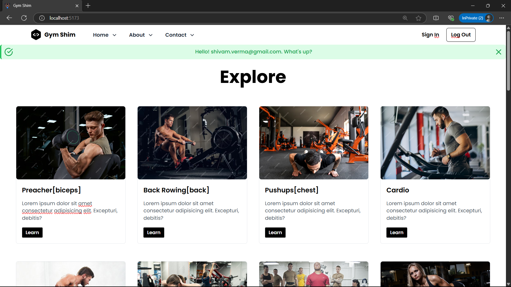

# Gym Shim Shivam
This is a Gym website made by Shivam Verma as a Self project, integrating ReactJs, Tailwind CSS, Javascript, Auth0, CSS, etc.

### Preview of the Website

### Website link⤵️⤵️
[Visit The Website, here.](https://gymshimshivam.netlify.app/)

## Projects Skills Used:
- `ReactJs` & Hooks : Frontend
- `Auth0` :  for login & logout
- 

### Codebase Size
